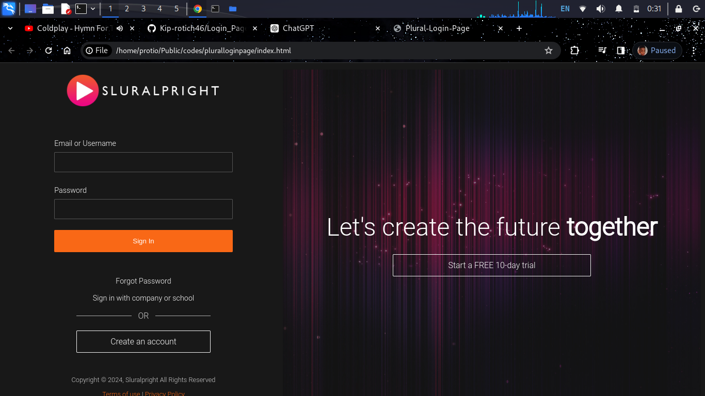
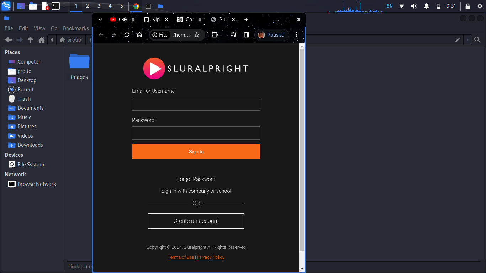

# Login Template

## Overview
This project is a simple and clean login template designed using only HTML and CSS. It provides a basic structure for a login page that can be easily integrated into any web application.

## Table of Contents
- [Features](#features)
- [Screenshots](#screenshots)
- [Technologies Used](#technologies-used)
- [Setup](#setup)
- [Usage](#usage)
- [Contributing](#contributing)
- [License](#license)

.

## Features
- Clean and modern design
- Fully responsive
- Easy to customize
- Cross-browser compatibility

## Screenshots

### Login Page



## Technologies Used
- HTML5
- CSS3

## Setup
1. Clone the repository:
    ```sh
    git clone https://github.com/Kip-rotich46/login-template.git
    ```

2. Navigate to the project directory:
    ```sh
    cd login-template
    ```

3. Open `index.html` in your browser to view the login template.

## Usage
Feel free to use this login template for your own projects. You can customize the content and styles according to your needs.


